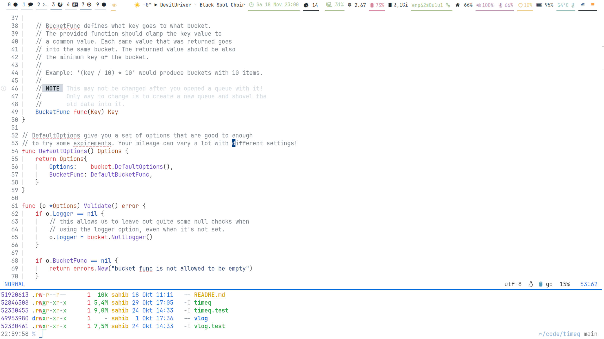

Dotfiles
========

My own mix of dotfiles required for my sanity. Feel free to pick whatever you like, but don't expect it's always up-to-date or working as you'd like it is.

I use [chezmoi](https://www.chezmoi.io) to version those files (thus the slightly off naming). This allows me to restore/update all my dotfiles with just a single command:

```bash
# `chezmoi` should be installed first:
$  chezmoi init --apply sahib
```

```bash
# After the init, update once something new was pushed:
$ chezmoi update
```

```bash
# Check for differences made in the dotfiles:
$ chezmoi diff
```

Theming
-------

I'm one of the few odd people that use light colorschemes for most things. That's mostly because I tend to work in well-lit places and dark themes are hard on the eyes there. If you live in your cellar, then dark themes might be the way to go.



Editor
------

The most advanced thing is probably my Neovim config. Not really surprising since I spent my work day in this application. It uses packer and lua based configuration, which was copied from all over the internet although a good chunks comes from [here](optimizacija/neovim-config) (Thanks!).

Packages
--------

* **kitty**: Terminal.
* **zsh:** Shell.
* **neovim**: Editor.
* **sway**: Wayland compositor.
* **waybar**: Statusbar on top.
* **wofi**: Launcher application.
* **zoxide**: Directory autojumpger.
* **nm-applet**: Networkmanager interface.
* **udiskie2**: Automounter.
* **most**: Pager.
* **zathura**: PDF viewer (muPDF backend)
* **exa**: Better ls
* **mako**: Notification manager.
* **swayidle:** Idle manager.
* **swaylock:** Lock screen.
* **swaybg:** Simple background setter (or see wallday/)
* **gammastep:** Adjust to daylight.
* **sxiv:** Image viewer.
* **grimshot/slurp:** Screenshot taking.

Fonts:

* JetBrainsMono: Monospace font (with nerd symbols)
* OpenMoji-Color: Emoji Font.
* Vollkorn: Documents.
